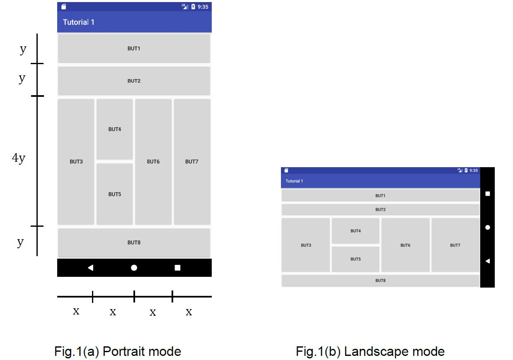

# linear-layout-app
A simple mobile application with buttons arranged using Linear Layout. 

The project gradle is named "LinearLayout".

The buttons would have to be arranged using Linear Layout following the design shown below.

